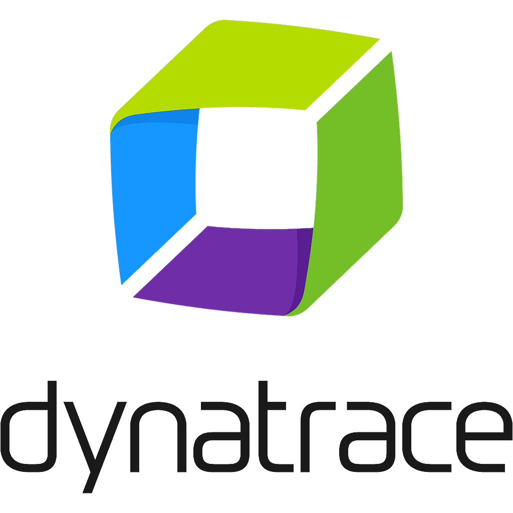
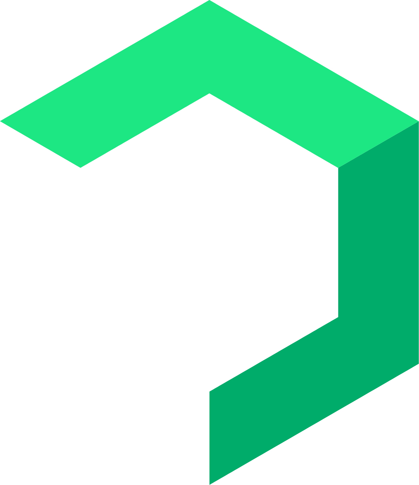

# 🌠  Call me Harry

**`Hi! I'm Devops`**

<!-- Quick Introduction -->

---

## 🧰 Tech and Tools
#

### Cloud Povider

  

#

### CI/CD

 

#

### Container Orchestration

 

#

### Monitoring

 

#

### Management

 

#

### Programming languages & Framework

 

#

### other

 

#

### 📊 Stats

<!--  -->

#

 
<h3>👨‍💻 DevOps Journey</h3>

   I started my coding journey as a ....
